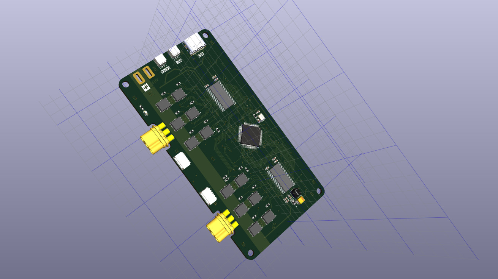

# 电机驱动套件

好久没更新个人项目进展了，这次自制了手掌一半大小的 FOC 矢量控制驱动器，用于驱动永磁同步电机（PMSM）。

这种电机不能像电风扇一样通电就转，需要使用三相交流电合成三维空间磁场来引导转子转动。

所以需要软件算法和硬件电路来将直流电逆变成交流电以及合成出矢量空间磁场。

逆变电路采用了英飞凌的 DirectFET-MOS 管，最高电压 60V，单路最大驱动电流 100A，所以峰值输出功率高达 6KW。

板载了 RS485，CAN，USB，串口等总线，所以运行 Linux 系统的主控就可以和它通信了。

支持恒定扭矩，功率输出，做到低转速恒扭矩，并增加高精度磁编码器和闭环控制使得可以精确的控制电机转动角度。

还支持力反馈，就是说有了这个驱动器，电机转轴受到的阻力多大控制端可以感知到这个力，这对机器人的动作执行单元来说是必备条件。

配套的 AS5047 高精度 14 bit，高速 20K RPM 磁编码器模块，模块用于改装配套大疆精灵 3 拆机无刷电机 2312S，模块可以在淘宝搜索购买。

# 固件

我将 ODrive 的固件（驱动程序）适配到了 MotorKit 套件，简化了 ODrive 的文件组织方式，方便理解代码，并且将 ODrive 复杂的编译方式改成使用 CMake 进行构建，并且可以搭配 VSCode 进行图形化调试，这有利于理解 ODrive 的程序

基于 ODrive V5.6 改版的 MotorKit 固件: https://github.com/zhbi98/ODrive，直接烧录到 MotorKit 就可以运行。

如果没有 VSCode 的嵌入式开发环境，可以看看这篇文章：https://blog.csdn.net/jf_52001760/article/details/126826393
